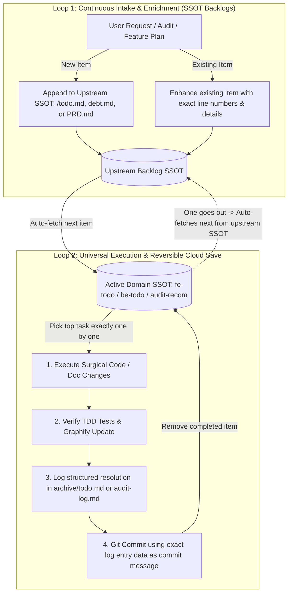

# Universal Task & Commit Execution Loop (Reversible Cloud Save)

This rule applies to **ALL agents and human developers** working on **ANY type of task** across the DJP-v1 repository (feature development, bug fixes, TDD implementation, refactoring, documentation updates, and technical debt resolution).

---

## 🚀 0. Mandatory Session Initialization Protocol

Whenever an agent or developer starts a new session or is invoked for **ANY task**, before taking any action or writing any code:
* **If Task = Audit:** Read `audit` SSOT files (`docs/audit/debt.md`, `docs/audit/audit-recom.md`, `docs/audit/audit-log.md`) **+ Git history (`git log -n 15 --oneline`, `git status`)**.
* **If Task = Normal (Feature, Bug, TDD, Refactor, Docs):** Read **Git history (`git log -n 15 --oneline`, `git status`)** (+ active domain `todo.md` / `*-todo.md`).
* **Why it matters:** Checking Git commit history right at startup gives instant context on what was previously built or patched (`Reversible Cloud Save` logs), avoiding duplicate work or regressions before coding begins.

---

## 🧠 1. Real Developer Mindset & Continuous Learning Mode (`Weekly Proactive Audits`)

All 7 core agent roles (`PM Agent`, `Tech Arch Agent`, `TL Agent`, `QA Agent`, `FE Agent`, `BE Agent`, `GitHub & CI/CD Agent`) MUST act like **real, senior software engineers** collaborating on an elite engineering team:
* **Continuous Learning Mode:** Never remain static. Always learn from recent tasks, code reviews (`/ponytail-review`), and external domain best practices. Continuously update the repository knowledge base (`CONCEPTS.md`, `docs/solutions/`, `architecture.md`, `SKILL.md`) when new patterns, security fixes, or scalability improvements are discovered.
* **Proactive Team Thinking:** Constantly think like real engineers by asking:
  * *How can we make our system more secure against OWASP vulnerabilities and data leaks?*
  * *How can we make our microservices more scalable under high concurrent load?*
  * *How can we make our code 100% defect-free and resilient to edge cases?*
* **Weekly Proactive Audits:** Every week (or when scheduled via `/schedule`), the agent team performs a holistic project audit based on their updated knowledge base. Any opportunities to enhance security, scalability, performance, or reliability are immediately appended to `docs/audit/debt.md` per `Loop 1` using the standardized `- **Worker/Who:** [Role e.g., Tech Arch Agent | Model e.g., Antigravity (Gemini)]` schema!

---

## 🔄 The Universal Double-Loop Architecture

Every task lifecycle across the monorepo operates via two tightly coupled loops:



---

## 📋 Standard Mandatory Steps for Every Completed Task

Whenever you finish working on any task from `/todo.md`, `fe-todo.md`, `be-todo.md`, `test-todo.md`, `specs.md`, or `audit-recom.md`:

### Step 1: Log the Resolution (`*-log.md` / `archive/todo.md`)
Append a structured record of the completed task to the appropriate domain log (`archive/todo.md` for general features/todos, or `docs/audit/audit-log.md` for debt resolutions) containing:
* **Task ID / Title:** What was accomplished.
* **Worker/Who:** Who implemented the work in `Role | Model` format (`Backend Agent | Antigravity (Gemini)`, `QA Agent | Nemotron`, `FE Agent | Human`).
* **Files Modified / Created:** Explicit list of paths changed.
* **Resolution Summary:** Technical rationale and changes applied.
* **Verification Commands:** Exact test commands run (`mvn test`, `npm test`, `graphify update .`).

### Step 2: Git Commit Using Log Data (`Reversible Cloud Save`)
Once verified and approved/satisfied, **commit the code, docs, and the updated log file using the exact log data as the git commit message**:

```bash
git add .
git commit -m "feat(domain): [RESOLVED] Task Title or ID" \
           -m "Worker/Who: [e.g., Backend Agent | Antigravity (Gemini)] | Upstream SSOT: [e.g., be-todo.md]" \
           -m "Summary: [Exact summary from resolution log entry]" \
           -m "Files Changed: [List of modified paths]" \
           -m "Verification: [Exact commands run e.g., mvn test | graphify update .]"
```

#### **Why This Is Mandatory for All Tasks:**
* **Cloud Reversibility:** Storing the exact structured task details, verification proof, and file lists inside the Git commit message pushes the full context directly to the remote repository (cloud).
* **Zero-Guesswork Rollbacks:** If a feature or fix causes a regression, any engineer or agent can inspect `git log` and perform a clean, surgical `git revert <SHA>` with 100% historical context intact.

### Step 3: Auto-Fetch Replenishment ("One Goes Out, Auto-Fetches Next")
* Remove or check off the completed task inside the active domain backlog (`fe-todo.md`, `be-todo.md`, `audit-recom.md`).
* **Auto-Fetch & Repeat Loop:** Immediately check the upstream backlog (`/todo.md`, `docs/audit/debt.md`, or `specs.md`) for the next highest-priority item, move/copy it into the active domain backlog, and **repeat the loop (`Every task -> Git commit -> Auto-fetch -> Next task`) continuously!**
* **Universal Markdown Metadata Guardrail:** Whenever creating any new `.md` file during task execution, always prepend the standardized **Front Metadata Header Table** right below the title block per `.agents/rules/markdown-metadata-guardrail.md`.
