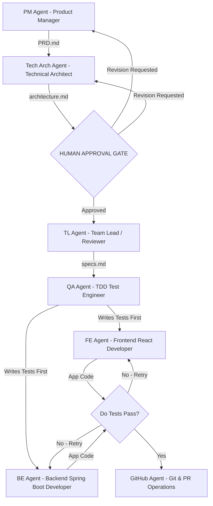

# DJP Master Guide: Production-Grade Agentic Workflow & Team Hierarchy

This document records our complete architecture and workflow setup for building DJP as a **Monorepo** with **Modular Microservices** using autonomous AI Agents.

---

## 1. Team Hierarchy & Roles



---

## 2. Spec-Driven & Test-Driven Development (TDD) Flow

1. **User Goal**: Written in `todo.md`.
2. **PM Agent**: Creates Product Requirements Document (`docs/execution/<feature>/PRD.md`).
3. **Tech Arch Agent**: Creates Technical Architecture (`docs/execution/<feature>/architecture.md`).
4. **🛑 Circular Human Approval Gate**: User reviews and approves PRD + Architecture before coding begins.
5. **TL Agent**: Creates File & Component Specification (`docs/execution/<feature>/specs.md`).
6. **QA Agent (TDD Red Phase)**: Writes automated test suites *before* application code exists.
7. **TL Quality Check**: Verifies QA test edge cases.
8. **FE & BE Agents (TDD Green Phase)**: Write application code to pass QA tests (Max 3 retry loop).
9. **GitHub Agent**: Commits docs/tests, creates branches, and merges Pull Requests.

---

## 3. Master Folder & Documentation Structure

```text
DJP-v1/
├── .djp_identity.md                            # DJPv1 User Profile & Tech Stack Baseline
├── .djp_state.md                               # DJPv1 Active Session Objectives & Delta Logs
├── .djp_rules.md                               # DJPv1 Operational & Code Quality Rules
├── AGENTIC_WORKFLOW_GUIDE.md                   # This Master Guide
├── todo.md                                     # Master Task List (PM input)
├── .agents/
│   └── AGENTS.md                               # Agent Team Operating Rules
├── frontend/                                   # React Frontend
├── backend/
│   └── springboot/                             # Java 21 + Spring Boot 3 Microservices
│       ├── src/main/resources/application-h2.yml       # Local H2 Profile
│       └── src/main/resources/application-supabase.yml # Prod Supabase Profile
└── docs/
    ├── README.md                               # Documentation Sitemap
    ├── vision/                                 # PRDs
    ├── architecture/
    │   ├── backend-microservices-techstack.md  # Microservice Tech Stack Definitions
    │   └── oauth-login-architecture.md         # Feature Architecture
    └── development/                            # TL Specs
```

---

## 4. Agent Commander Cheat Sheet

Whenever you want to build a new feature:
1. Open [todo.md](file:///home/ap/git-repo/DJP-v1/todo.md) and add your feature to the list.
2. Type in Antigravity chat:
   > *"Start the active task in `todo.md` using our Agent Team rules."*
3. Approve the blueprints at the **Human Approval Gate**.
4. Watch the agents write tests first and build your feature until tests pass green ✅!
