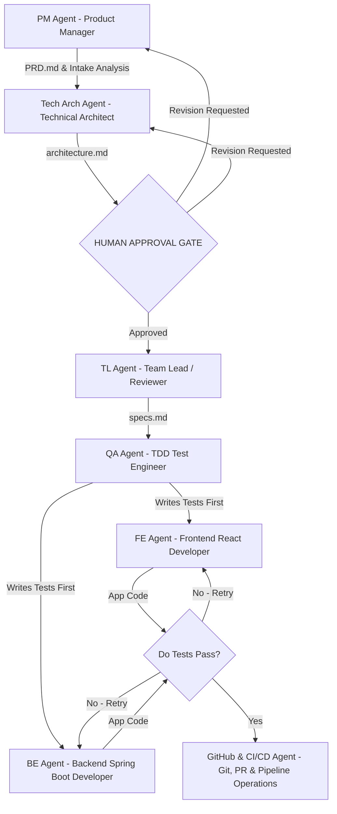

# DJP Master Guide: Production-Grade Agentic Workflow & Team Hierarchy

This document records our complete architecture, domain todo ecosystem, and agentic team workflow for building DJP as a **Monorepo** with **Modular Microservices** using autonomous AI Agents.

---

## 1. Team Hierarchy & Roles



---

## 2. Visual Task Flow Across Todos

Our repository separates **user intake**, **domain execution**, and **historical archiving** into dedicated Single Source of Truth (`SSOT`) files.

```text
       [ User Request / Goal ]
                 │
                 ▼
       ┌───────────────────┐
       │   Root /todo.md   │  ◄── 1. USER WRITES 1–2 LINE GOAL HERE
       └─────────┬─────────┘
                 │
                 ▼
         [ PM Agent Reads ]
                 │
                 ▼
┌─────────────────────────────────┐
│ docs/execution/<feature>/PRD.md │  ◄── 2. PM ANALYZES & SCOPES PRD
└────────────────┬────────────────┘
                 │
     ┌───────────┼───────────┐
     ▼           ▼           ▼
┌──────────┐ ┌──────────┐ ┌──────────┐
│fe-todo.md│ │be-todo.md│ │test-todo │ ◄── 3. DOMAIN AGENTS EXECUTE
└────┬─────┘ └────┬─────┘ └────┬─────┘
     │            │            │
     └────────────┼────────────┘
                  ▼
         ┌─────────────────┐
         │ archive/todo.md │           ◄── 4. COMPLETED LOGS (Date-Wise)
         └─────────────────┘
```

### Summary Role Table

| Todo File | Primary Writer / Owner | Role & Purpose |
| :--- | :--- | :--- |
| **`/todo.md` (Root)** | **User / PM Agent** | **Entry Point & User Intake Portal.** User enters 1–2 line goals here. |
| **`/dashboard.md` (Root)** | **PM / TL Agents** | **Executive Dashboard Control Center.** Aggregates progress & status. |
| **`docs/execution/<feature>/todo.md`** | **PM / Tech Arch / TL** | **Feature Execution SSOT.** Tracks PRD, Architecture, and Spec milestones. |
| **`frontend/fe-todo.md`** | **FE Agent** | Active React UI & frontend state tasks. |
| **`backend/be-todo.md`** | **BE Agent** | Active Spring Boot microservice endpoints & database tasks. |
| **`tests/test-todo.md`** | **QA Agent** | Active TDD automated test suite tasks. |
| **`archive/todo.md`** | **All Agents (Automated)** | Chronological date-wise history of completed tasks across all sessions. |

---

## 3. Spec-Driven & Test-Driven Development (TDD) Flow

1. **User Goal**: User adds a simple 1–2 line request in `/todo.md`.
2. **PM Agent**: Reads `/todo.md`, classifies target domains (`FE/BE/QA`), defines acceptance criteria, asks clarifying questions if needed, and creates Product Requirements Document (`docs/execution/<feature>/PRD.md`).
3. **Tech Arch Agent**: Creates Technical Architecture (`docs/execution/<feature>/architecture.md`).
4. **🛑 Circular Human Approval Gate**: User reviews and approves PRD + Architecture before coding begins.
5. **TL Agent**: Creates File & Component Specification (`docs/execution/<feature>/specs.md`) and dispatches tasks to `fe-todo.md`, `be-todo.md`, and `test-todo.md`.
6. **QA Agent (TDD Red Phase)**: Reads `test-todo.md` and writes automated test suites *before* application code exists.
7. **TL Quality Check**: Verifies QA test edge cases.
8. **FE & BE Agents (TDD Green Phase)**: Read `fe-todo.md` / `be-todo.md` and write application code to pass QA tests (Max 3 retry loop).
9. **Universal Double-Loop & Reversible Cloud Save (`universal-task-commit-loop.md`)**: When any task finishes across `fe-todo.md`, `be-todo.md`, or `test-todo.md`, the agent records the exact details in `archive/todo.md` and **commits the changes using the exact log entry data as the multi-line Git commit message (`Cloud Save`)**. Then, it removes the item (`one goes out`) and **auto-fetches the next highest-priority task from the upstream backlog (`todo.md` / `specs.md`)** to maintain continuous replenishment.

---

## 4. Master Folder & Todo Architecture Structure

```text
DJP-v1/
├── .djp_identity.md                            # DJPv1 User Profile & Tech Stack Baseline
├── .djp_state.md                               # DJPv1 Active Session Objectives & Delta Logs
├── .djp_rules.md                               # DJPv1 Operational & Code Quality Rules
├── AGENTIC_WORKFLOW_GUIDE.md                   # This Master Guide
├── todo.md                                     # User Intake Portal (1-2 line input)
├── dashboard.md                                # Executive Status & Progress Aggregator
├── archive/
│   └── todo.md                                 # Chronological Date-Wise Completed Tasks Log
├── .agents/
│   ├── AGENTS.md                               # Agent Team Operating Rules
│   └── roles/                                  # PM, Tech Arch, TL, QA, FE, BE, GitHub Specs
├── frontend/
│   ├── fe-todo.md                              # Frontend UI Execution Tracker
│   └── src/                                    # React 18 + TypeScript + Vite Source
├── backend/
│   ├── be-todo.md                              # Backend Microservices Execution Tracker
│   └── springboot/                             # Java 21 + Spring Boot 3 Microservices
├── tests/
│   ├── test-todo.md                            # QA / TDD Suite Execution Tracker
│   └── ...                                     # Automated Test Suites
└── docs/
    ├── README.md                               # Documentation Sitemap
    └── execution/                              # Feature PRDs, Architectures, and SSOT Todos
```

---

## 5. Agent Commander Cheat Sheet

Whenever you want to build or fix a feature:
1. Open [`/todo.md`](file:///home/ap/git-repo/DJP-v1/todo.md) and type a simple 1–2 line request.
2. Type in chat:
   > *"Start the active intake request in `/todo.md` using our Agent Team rules."*
3. PM Agent analyzes, scopes target domains, and prepares the blueprints.
4. Approve the blueprints at the **Human Approval Gate**.
5. Watch the agents write tests first and implement across `fe-todo.md`, `be-todo.md`, and `test-todo.md` until tests pass green ✅!
