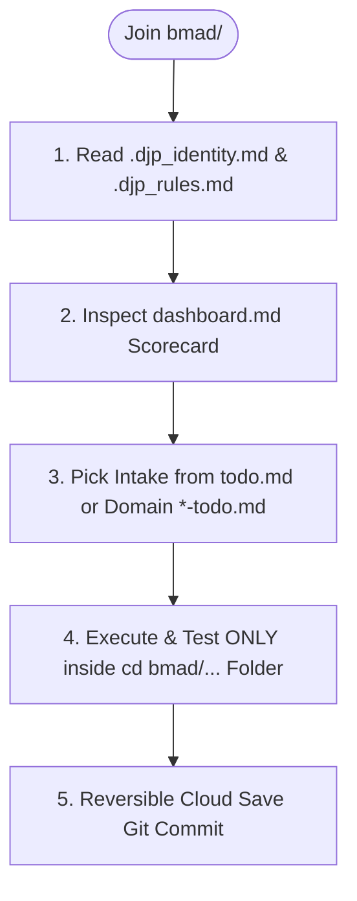

# DJP BMAD Agentic Workflow Guide (`web-app = bmad`)

---

| Metadata | Value |
| :--- | :--- |
| **📌 Purpose** | Master onboarding flowchart, Git branching rules, and commit protocol for `web-app = bmad`. |
| **📅 Last Updated** | 2026-07-19 |
| **🏷️ Status / Version** | Active SSOT / v1.0.0 |
| **👥 Owner / Worker** | `Worker/Who: [Tech Arch Agent / TL Agent | Antigravity (Gemini)]` |
| **🔗 Upstream / Dependencies** | [`bmad/README.md`](file:///home/ap/git-repo/DJP-v1/bmad/README.md), [`bmad/dashboard.md`](file:///home/ap/git-repo/DJP-v1/bmad/dashboard.md) |

---

## 🧭 Dev & Agent Onboarding Flowchart



---

## 🌿 Git Strategy (`base` vs `bmad`)
* **`base` Branch (`Prototype SSOT`)**: Holds `prototype/` (`web-app = prototype`).
* **`bmad` Branch (`BMAD SSOT`)**: Forked off `base`. Holds `bmad/` (`web-app = bmad`). Work in this folder must execute on `bmad`.
* **Reversible Cloud Save Commit Protocol:** Every completed task must be committed with structured logs:
  ```bash
  git commit -m "feat(bmad/domain): concise summary" -m "Worker/Who: [Role | Model]" -m "Verification: [test commands run]"
  ```

## 🔄 Double-Loop Task Replenishment
1. **Intake:** Pick task from `todo.md` or domain trackers (`fe-todo.md`, `be-todo.md`, `test-todo.md`).
2. **Copy/Adapt:** Re-use components/routes from `prototype/` or root (`apps/citizen`, `/backend`). Zero boilerplate rule.
3. **Verify & Archive:** Run tests, commit, mark `[x]`, move to `archive/archive-todo.md`, and auto-fetch next item (`one goes out -> auto fetches from upstream`).
