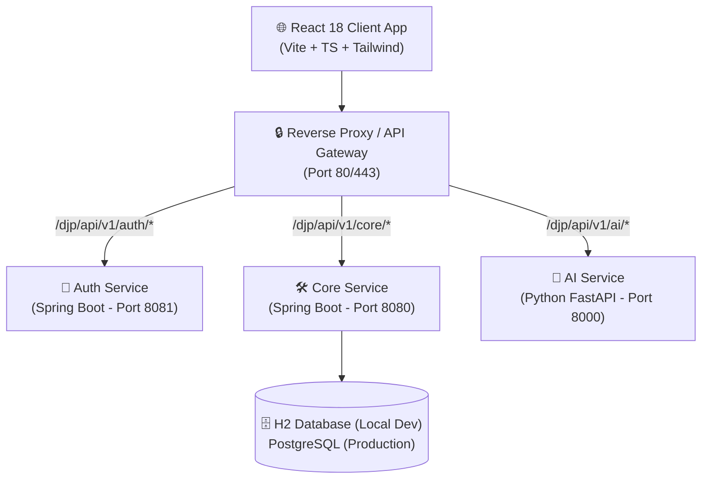

# 🏛️ **Architecture Overview**

---

| Metadata | Value |
| :--- | :--- |
| **📅 Last Updated** | 2026-07-18 00:50 |
| **📌 Status** | `Stable` |
| **🏷️ Version** | `v1.0.0` |
| **👥 Owner** | `Principal Technical Architect` |
| **🔗 Dependencies** | None |

---

## 🏗️ 1. System Architecture

The **DJPlatform App** operates as a decoupled, multi-tier civic engagement network. It separates citizen action from political party management. The platform is built on a **React 18 frontend** and a **modular microservices backend**. All base paths (`/djp/api/v1`), ports, and service definitions are governed centrally by **[global-config.yaml](global-config.yaml)**.

### Microservices Block Diagram

---

## 🧱 2. Key Components

* **🌐 Frontend Core:** Built on **React 18 (Vite, TypeScript, Tailwind CSS)**, managing asynchronous API calls via TanStack Query.
* **🔑 Auth Service:** Java Spring Boot service responsible for Google/LinkedIn OAuth2 flows, JWT creation, token signing, and session validation.
* **🛠️ Core Service:** Java Spring Boot service processing the business logic for Issues (I), Discussions (D), Polls (P), and user reputation metrics.
* **🧠 AI Service:** Python FastAPI service executing machine learning models to classify issues as solvable vs. non-solvable, and verifying resolutions via visual before/after image comparison.
* **🔒 API Gateway:** A lightweight reverse proxy routing client requests to the correct port based on path prefixing.

---

## 💡 3. Core Concepts

* **🔍 Action-Oriented vs. Conversation-Oriented:** The frontend clearly separates actionable **Issues (I)** (which AI maps to local volunteer campaigns or petitions) from conversation-oriented **Discussions (D)** (which capture any national debate or cultural concern).
* **📱 Responsive Design:** Mobile-first layout with layout adaptation optimized for digitally active, educated urban early-adopters.
* **🔐 Double-Lock Verification:** A problem resolution requires both GPS proximity check-ins from local witnesses (within 500m) and AI visual before/after analysis.
* **📈 Dynamic Ranks:** Ranks are periodically recalculated using a rolling 6-month active reputation score, while permanent profile badges display lifetime contributions.

---

## 🧰 4. Technology Stack

| Layer | Component | Technologies |
| :--- | :--- | :--- |
| **Frontend** | Client SPA | React 18, Vite, TypeScript, Tailwind CSS, TanStack Query |
| **Gateway** | API Router | Reverse Proxy (Nginx / Spring Cloud Gateway) |
| **Backend Auth** | Security | Java 21, Spring Boot, Spring Security, JWT, OAuth2 |
| **Backend Core** | Business API | Java 21, Spring Boot, Spring Data JPA, H2 / PostgreSQL |
| **Backend AI** | ML Inference | Python 3.11+, FastAPI, PyTorch / OpenCV |

---

## 📚 Related Documentation

* **[Vision](../vision/party-vision.md)** — Core framework and app scope
* **[Roadmap](../vision/roadmap.md)** — Staged release schedule (v1.1, v1.2, v1.3)
* **[Decisions](../vision/decisions.md)** — Architectural decision records (ADR-001 to ADR-007)
* **[System Boundaries](system-boundaries.md)** — Detail network and routing definitions
* **[Frontend Monorepo Spec](frontend.md)** — UI design tokens and package structures
* **[Backend Design Spec](backend-design.md)** — Core schema and REST API endpoints