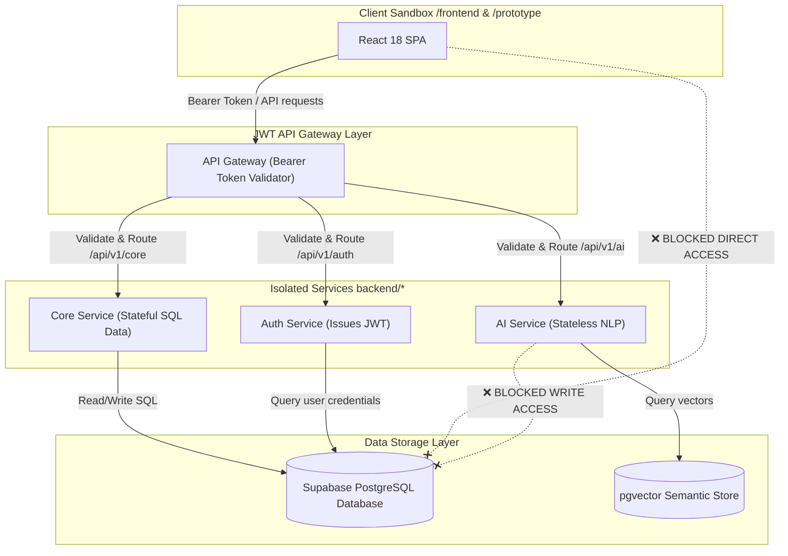
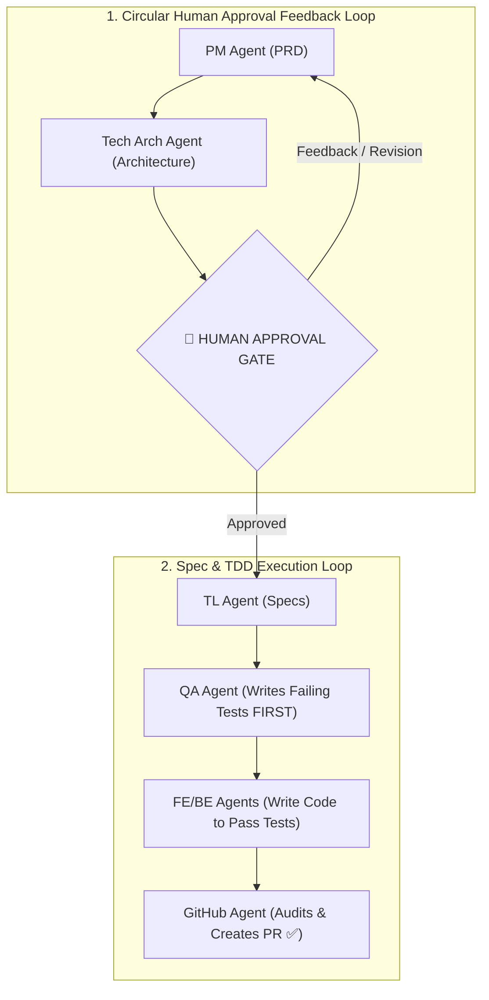

# 🏛️ System Boundaries & Agentic Guardrails Matrix

> **Purpose:** Establish production-ready boundaries, clear ownership, exact technical stacks, and AI agent guardrails across the Digital Janta (DJP) platform.

---

## 1. Executive Summary & Big Picture

---

## 2. Identified Architectural Areas & Domain Boundaries

| Domain Area | Directory Path | Core Responsibilities | Technology Stack | Boundary Guardrails |
| :--- | :--- | :--- | :--- | :--- |
| **Frontend App** | `frontend/` | UI rendering, user interaction, state management, client validation | React 18, TypeScript, Vite, Tailwind CSS | No direct DB access; must communicate strictly via Gateway API endpoints. |
| **Prototype App** | `prototype/` | Sandbox playground for component design iterations and static UI/UX mockups | React 18, TypeScript, Vite, Tailwind CSS | Isolated from live backend APIs; operates strictly with mock JSON states. |
| **Auth Service** | `backend/auth-service` | Identity management, OAuth2 login, JWT issuance, session security | Java 21, Spring Boot 3, Spring Security | Sole authority on authentication tokens and user credentials. |
| **Core Service** | `backend/core-service` | Civic issues, democratic discussions, citizen polls, proposals | Java 21, Spring Boot 3, Spring Data JPA, Supabase PostgreSQL | Owns civic business logic and relational domain tables. |
| **AI Service** | `backend/ai-service` | LLM processing, semantic vector search, Recommendation pipelines | Python 3.11, FastAPI, Pydantic, pgvector | Stateless inference and semantic embeddings only. |
| **Quality & Tests** | `tests/` | Automated verification, TDD regression suites, API contract checks | Playwright, JUnit 5, PyTest | Must run and pass before any code merge. |

---

## 3. Agentic Workflow Guardrails & Responsibilities

### Strict Agent Enforcement Rules:
1. **No Code Without Tests:** Application code (`frontend/`, `backend/`) cannot be written until QA automated tests exist in `tests/`.
2. **Lean Codebase Guarantee:** Do not generate speculative abstractions, placeholder wrappers, or dead code.
3. **Mandatory Post-Task Cleanup:** After every completed task, run `/graphify update .` and `/ponytail-review` to remove over-engineering.

---

## 4. Key Takeaways & Memory Aid

* **Key Takeaway 1:** Every microservice has strict boundary isolation — no cross-service direct database calls.
* **Key Takeaway 2:** All feature execution requires **PRD → Arch → Approval Gate → TDD Red → Code Green**.
* **Memory Aid:** **"Plan First, Test First, Code Lean."**
