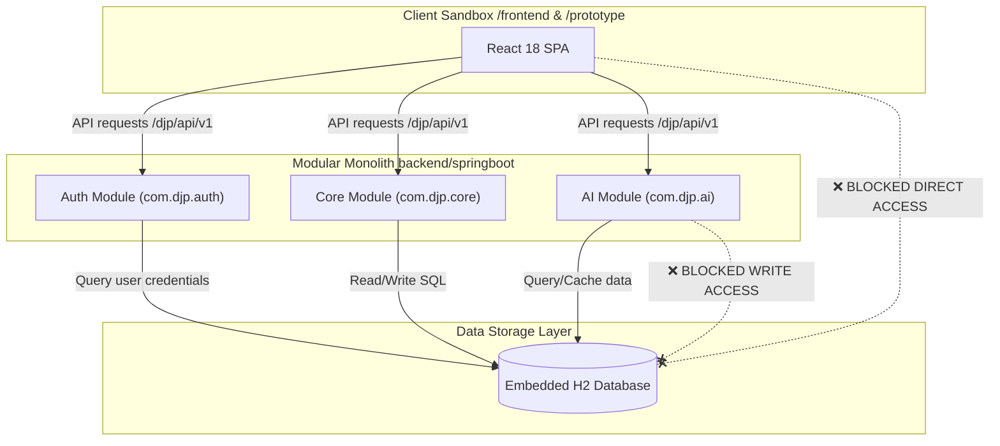
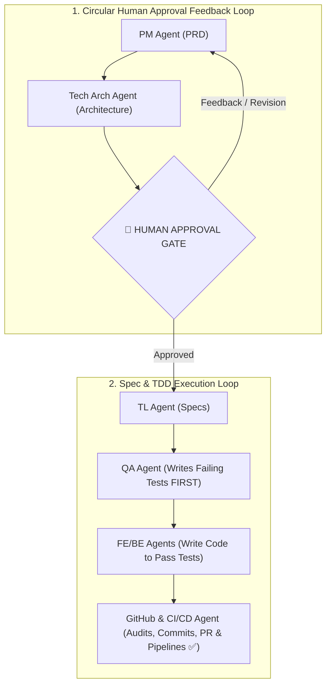

# 🏛️ System Boundaries & Agentic Guardrails Matrix

---

| Metadata | Value |
| :--- | :--- |
| **📅 Last Updated** | 2026-07-18 00:50 |
| **📌 Status** | `Stable` |
| **🏷️ Version** | `v1.0.0` |
| **👥 Owner** | `Principal Technical Architect` |
| **🔗 Dependencies** | [overview.md](overview.md), [backend-design.md](backend-design.md) |

---

## 1. Executive Summary & Big Picture

---

## 2. Identified Architectural Areas & Domain Boundaries

| Domain Area | Directory Path | Core Responsibilities | Technology Stack | Boundary Guardrails |
| :--- | :--- | :--- | :--- | :--- |
| **Frontend App** | `frontend/` | UI rendering, user interaction, state management, client validation | React 18, TypeScript, Vite, Tailwind CSS | No direct DB access; must communicate strictly via Gateway API endpoints. |
| **Prototype App** | `prototype/` | Sandbox playground for component design iterations and static UI/UX mockups | React 18, TypeScript, Vite, Tailwind CSS | Isolated from live backend APIs; operates strictly with mock JSON states. |
| **Modular Monolith Backend** | `backend/springboot/` | Identity, OAuth2, JWT auth, civic issues, discussions, polls, and local storage | Java 21, Spring Boot 3, Spring Data JPA, Embedded H2 | Consolidated single backend deployable for MVP. |
| **Quality & Tests** | `tests/` | Automated verification, TDD regression suites, API contract checks | Playwright, JUnit 5, PyTest | Must run and pass before any code merge. |

---

## 3. Agentic Workflow Guardrails & Responsibilities

> [!NOTE]
> These agentic guardrails align with the **BMAD (Breakthrough Method for Agile AI-Driven Development)** framework. The development lifecycle is structured, documentation-first, and role-segregated to prevent "vibe coding" and ensure production-quality output.

### Strict Agent Enforcement Rules:
1. **No Code Without Tests:** Application code (`frontend/`, `backend/`) cannot be written until QA automated tests exist in `tests/`.
2. **Lean Codebase Guarantee:** Do not generate speculative abstractions, placeholder wrappers, or dead code.
3. **Mandatory Post-Task Cleanup:** After every completed task, run `/graphify update .` and `/ponytail-review` to remove over-engineering.

---

## 4. Key Takeaways & Memory Aid

* **Key Takeaway 1:** Every microservice has strict boundary isolation — no cross-service direct database calls.
* **Key Takeaway 2:** All feature execution requires **PRD → Arch → Approval Gate → TDD Red → Code Green**.
* **Memory Aid:** **"Plan First, Test First, Code Lean."**
