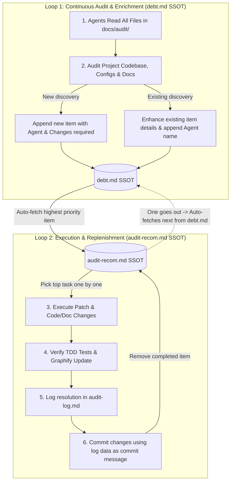

# 📊 DJP Platform Audit & Technical Debt Management System

This directory coordinates the automated audit reporting, debt shortlisting, and patch-tracking lifecycle for the DJP platform. It ensures that technical, security, and process debt is resolved systematically by developers and AI agents.

---

## 🔄 Dual-Loop Audit & Execution Architecture



---

## 🏛️ Single Sources of Truth (SSOT)

1. **`docs/audit/debt.md` (Audit Findings SSOT):**  
   The single canonical register of all discovered technical, architectural, security, governance, and process debt across the platform. Every item discovered during an audit is recorded or enhanced here.
2. **`docs/audit/audit-recom.md` (Task Pickup SSOT):**  
   The active execution backlog. Agents and developers pick up tasks exclusively from `audit-recom.md` one by one. As tasks are completed and removed ("one goes out"), the system automatically fetches the next highest-priority item from `debt.md` to replenish the queue.
3. **`docs/audit/audit-log.md` (Resolution Log SSOT):**  
   The permanent historical ledger of completed patches, verification commands, and resolving agents.

---

## 📋 Standard Item Schema (`debt.md` & `audit-recom.md`)

Every debt item must follow this standardized schema. Instead of generic agent or ID arrays, every item MUST explicitly state **Worker/Who** (`Role | Model`) and **Changes required**:

```markdown
### [ID] — [Item Title]
* **Worker/Who:** [Role e.g., Backend Agent | Model e.g., Antigravity (Gemini)]
* **Severity:** 🔴 Critical | 🟠 High | 🟡 Medium
* **Changes required:** [Explicit list of code files, documentation files, configs, or modules needing modification. e.g., Code (`backend/springboot/src/.../AuthController.java`), Doc (`docs/api/api-spec.yaml`)]
* **Why it matters:** Brief explanation of risk, failure modes, or architectural impact.
* **Evidence:** File paths, line numbers, or structural discrepancies supporting the finding.
* **Recommended action:** Concrete, step-by-step resolution strategy.
* **Expected impact:** What system or governance improvement occurs once resolved.
```

---

## 🚀 Step-by-Step Operating Guide

### Loop 1: Continuous Learning & Weekly Proactive Audit Loop (`debt.md`)

All 7 core agent roles (`PM`, `Tech Arch`, `TL`, `QA`, `FE`, `BE`, `GitHub`) MUST act like **real, senior software engineers** on an elite product team. They operate in **Continuous Learning Mode**—constantly updating their technical knowledge base (`CONCEPTS.md`, `docs/solutions/`, `architecture.md`) and proactively thinking: *How can we make our system more secure? More scalable? More resilient? Defect-free?*

Whenever an agent is invoked or during scheduled **Weekly Proactive Audits**:
1. **Read Local State & Git History:** The agent MUST read all existing local files (`debt.md`, `audit-recom.md`, `audit-log.md`) **and check recent Git commit history (`git log -n 15 --oneline`, `git status`)** before analyzing code. This ensures the agent understands known issues, completed patches, and historical context right from the start.
2. **Audit & Inspect with Team Mindset:** Apply updated knowledge (latest security guidelines, scalable microservice patterns, zero-defect TDD practices) to inspect repository code, architecture definitions, database schemas, and workflows.
3. **Record or Enhance Findings (`debt.md` SSOT):**
   * **If a new issue is found:** Append a new entry to `debt.md` following the standard schema above, explicitly setting `- **Worker/Who:** [Role e.g., Tech Arch Agent | Model e.g., Antigravity (Gemini)]` and `- **Changes required:** [Target files/docs]`.
   * **If an existing issue is encountered:** Do not duplicate. Instead, **enhance the existing report** in `debt.md` by adding exact line numbers, deeper root causes, or updated evidence, and append your worker identity to the `- **Worker/Who:**` field (e.g., `Tech Arch Agent | Antigravity (Gemini), QA Agent | Nemotron`).

### Loop 2: Autonomous Execution & Replenishment Loop (`audit-recom.md`)

When an agent or developer picks up debt resolution work:
1. **Pick One Task (`audit-recom.md` SSOT):** Select the highest-priority item currently listed in `audit-recom.md`. Work on exactly one task at a time.
2. **Execute Required Changes:** Modify the exact files specified in `- **Changes required:**`. Follow existing project conventions and write failing automated tests before or alongside application code changes (TDD Red-Green-Refactor).
3. **Verify & Sync Graph:** Run unit/integration tests and run `graphify update .` to keep the codebase AST graph current.
4. **Log Resolution (`audit-log.md`):** Append a structured resolution record to `audit-log.md` with date, resolving agent, files changed, summary, and verification commands executed.
5. **Git Commit Using Log Data (`Reversible Cloud Save`):** Once the changes are verified and satisfied, **use the exact log data from `audit-log.md` as the git commit message**.
   * Example:
     ```bash
     git add .
     git commit -m "fix(audit): [RESOLVED] ID: TECH-XXX — Title" \
                -m "Worker/Who: Backend Agent | Antigravity (Gemini)" \
                -m "Summary: Concise summary from log" \
                -m "Verification: mvn test | graphify update ."
     ```
   * **Why it matters:** Saving the exact resolution log right inside the git commit message ensures the patch context is permanently stored in the cloud (remote repo) and makes the entire change cleanly traceable and **100% reversible** via git (`git revert`).
6. **Auto-Fetch Replenishment & Next Task ("One Goes Out, Auto-Fetches Next"):**
   * Remove the completed item from `audit-recom.md`.
   * **Auto-Fetch:** Immediately check `debt.md` for the highest-priority open item that is not yet in `audit-recom.md`, and copy/move it into `audit-recom.md`.
   * **Loop:** Automatically pick up the next item from `audit-recom.md` and repeat!

---

> [!IMPORTANT]
> Always maintain the exact fields `- **Worker/Who:**` (`Role | Model`) and `- **Changes required:**` on every item in both `debt.md` and `audit-recom.md`. Never leave completed items in `audit-recom.md` or `debt.md` without logging them in `audit-log.md` and committing with that exact log data.
