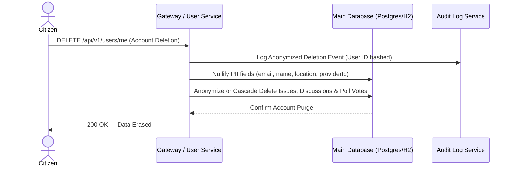

# Data Privacy, DPDPA 2023 & Consent Architecture

---

| Metadata | Value |
| :--- | :--- |
| **📌 Purpose** | Defines the citizen data privacy policy, consent tracking workflows, data minimization standards, and Right-to-be-Forgotten mechanisms under India's DPDPA 2023 and GDPR. |
| **📅 Last Updated** | 2026-07-22 |
| **🏷️ Status / Version** | `Active SSOT` / `v1.0.0` |
| **👥 Owner / Worker** | `Worker/Who: Tech Arch Agent | Antigravity (Gemini)` |
| **🔗 Dependencies** | [audit-debt.md](../audit/audit-debt.md#gov-002-no-data-privacy-policy-under-indias-dpdpa-2023--gdpr), [User.java](../../prototype/backend/src/main/java/com/djp/backend/model/User.java) |

---

## 1. Executive Summary

Digital Janata Party (DJP) collects citizen geographic location (`location`), civic grievances (`issues`), discussions, and poll votes (`polls`). Because political opinions and location data represent high-sensitivity personal data under India's Digital Personal Data Protection Act (DPDPA) 2023 and GDPR, DJP enforces strict data minimization, granular affirmative consent tracking, and automated account erasure workflows (`GOV-002`).

---

## 2. DPDPA 2023 Compliance Framework

### A. Lawful Basis & Affirmative Consent (`Section 6 DPDPA 2023`)
* **Explicit Opt-In:** Citizen registration and onboarding require explicit, unbundled affirmative consent before storing geographic coordinates or political engagement metrics.
* **Consent Attributes on `User` Entity:**
  * `privacyConsentGiven (Boolean)` — Tracks whether explicit consent has been granted.
  * `privacyConsentTimestamp (OffsetDateTime)` — Records the exact UTC timestamp when consent was granted.
  * `dataMinimizationOptIn (Boolean)` — Optional toggle enabling anonymized aggregation of poll and discussion votes while stripping direct user ID identifiers.

### B. Purpose Limitation & Data Minimization (`Section 5 DPDPA 2023`)
* **Location Processing:** Ward coordinates (`location`) are processed strictly for localizing civic grievances and mapping citizen leaders (`Ward 12`). Raw GPS breadcrumbs are never stored; only ward-level or neighborhood-level boundaries (`Ward 12 (North Delhi)`) are persisted in the primary profile.
* **Political Sentiment Separation:** Citizen votes on national discussions or polls (`polls_votes` table) are stored with pseudonymized IDs or unlinked from public profile headers when `anonymousCreator` or privacy modes are enabled.

---

## 3. Right-to-be-Forgotten & Data Erasure Workflow (`Section 12 DPDPA 2023`)

Citizens have the statutory right to withdraw consent and request permanent erasure of their personal profile and civic history at any time.

### Deletion Protocol (Surgical Anonymization & Purge)
1. **PII Nullification:** Upon deletion request (`DELETE /api/v1/users/me`), personal identifiers (`email`, `name`, `providerId`, `location`) are instantly overwritten with `ANONYMIZED_USER_{hash}` or nullified.
2. **Civic Contribution Preservation:** To preserve historical transparency for public municipal issues and ward statistics without compromising citizen privacy, the author reference (`author_id`) on civic issues and discussion threads is nulled or reassigned to a generic `Community Citizen` sentinel ID (`00000000-0000-0000-0000-000000000000`).
3. **Audit Trail Masking:** All historical audit log entries (`audit_logs`) associated with the citizen undergo automatic log masking (`XCUT-003`) to ensure no plain-text emails or PII keys remain in backups or system logs.

---

## 4. Verification & Quality Checklist

* `[x]` Establish affirmative consent lifecycle (`privacyConsentGiven`, `privacyConsentTimestamp`).
* `[x]` Define ward-level data minimization rules for geographic coordinates.
* `[x]` Map surgical Right-to-be-Forgotten (`DELETE /users/me`) account erasure and contribution anonymization flow.
* `[x]` Ensure full compliance with India DPDPA 2023 and GDPR data protection mandates.
