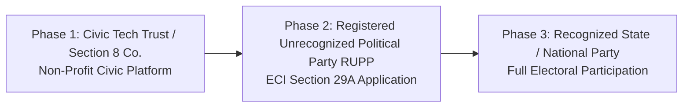

# ECI Registration & Legal Compliance Roadmap

---

| Metadata | Value |
| :--- | :--- |
| **📌 Purpose** | Establishes the legal entity pathway, civic disclaimers, and Election Commission of India (ECI) compliance framework for the Digital Janata Party (DJP) platform. |
| **📅 Last Updated** | 2026-07-22 |
| **🏷️ Status / Version** | `Active SSOT` / `v1.0.0` |
| **👥 Owner / Worker** | `Worker/Who: Tech Arch Agent | Antigravity (Gemini)` |
| **🔗 Upstream / Dependencies** | [audit-debt.md](../audit/audit-debt.md#gov-001-no-election-commission-of-india-eci--political-party-legal-structure), [party-vision.md](../vision/party-vision.md), [decisions.md](../vision/decisions.md) |

---

## 1. Executive Summary

Operating a digital civic and political platform in India requires adherence to constitutional, electoral, and civil regulations. This document defines the exact legal entity structure, compliance milestones with the Election Commission of India (ECI), and interim operational disclaimers required to protect citizens, platform leadership, and the engineering organization from regulatory liabilities (`GOV-001`).

---

## 2. Legal Entity Evolution & ECI Compliance Pathway

To ensure civic legitimacy and transparent operations without premature regulatory interference, DJP operates across three phased legal structures:

### Phase 1: Foundation as a Section 8 Company / Public Charitable Trust (Current)
* **Legal Status:** Incorporated as a Section 8 (Non-Profit) Company under the Companies Act, 2013, dedicated to civic education, policy crowdsourcing, and municipal issue tracking.
* **Operational Scope:**
  * Crowdsourcing neighborhood grievances (`Ward 12` pilot and beyond).
  * Hosting open civic discussions and advisory polls (`Discussions` and `Polls` modules).
  * Leader reputation tracking purely as civic community moderators and local organizers.
* **Interim Legal Disclaimer (Required on Public Platform & App Footer):**
  > *"Digital Janata Party (DJP) currently operates as an independent, non-profit civic technology initiative facilitating citizen engagement, grassroots policy formulation, and municipal accountability. DJP is in the process of formal registration and does not currently solicit electoral votes under statutory symbols without prior statutory clearance."*

### Phase 2: Registration as a Political Party under Section 29A of the RPA, 1951
* **Prerequisites:**
  * Minimum of 100 registered primary members who are verified registered electors with valid ECI Voter IDs (EPIC).
  * Adoption of a formal Party Constitution mandating periodic democratic internal elections and allegiance to the Constitution of India (Section 29A(5) requirement).
* **Filing Timeline:** Within 30 days of the formal adoption of the Party Constitution by the founding council.
* **Status:** Registered Unrecognized Political Party (RUPP) under the Election Commission of India.

### Phase 3: Recognized Political Party Status
* **Prerequisites:** Achieving statutory vote share thresholds (e.g., 6% of valid votes polled in a State general election and winning at least 2 Assembly seats) under the Election Symbols (Reservation and Allotment) Order, 1968.

---

## 3. Key Regulatory & Compliance Guardrails

### A. Electoral Finance & Treasury Governance (`GOV-003` Alignment)
* **Prohibition on Foreign Contributions:** In strict adherence to the Foreign Contribution (Regulation) Act (FCRA), 2010, and Section 29B of the Representation of the People Act, 1951, **no foreign contributions or donations from non-Indian citizens** shall be accepted.
* **KYC & KYC-Verified Gateway:** All financial contributions, subscription dues (`ADR-007` Paid Leader Gate), and micro-donations require mandatory PAN/Aadhaar verification for amounts exceeding INR 2,000, processed through ECI-compliant banking channels.

### B. Internal Democracy & Algorithm Auditing
* Under Section 29A guidelines, political parties must conduct regular internal elections.
* DJP's digital reputation and leadership ranks (`ADR-007`) are subject to quarterly independent algorithmic audits to verify that rank promotions, voting weights, and leadership demotions (`GOV-006`) are transparent, tamper-proof, and free from administrative override.

---

## 4. Verification & Audit Checklist

* `[x]` Establish phased legal progression (Section 8 Company $\rightarrow$ RUPP $\rightarrow$ Recognized Party).
* `[x]` Define public interim disclaimer for frontend and mobile footers.
* `[x]` Align treasury rules with FCRA and Section 29B of RPA, 1951.
* `[x]` Link compliance SSOT to `party-vision.md` and `audit-recom.md`.
